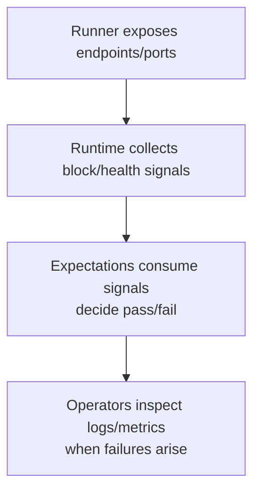

# Operations

Operational readiness focuses on prerequisites, environment fit, and clear
signals:

- **Prerequisites**: keep a sibling `nomos-node` checkout available; ensure the
  chosen runner’s platform needs are met (local binaries for host runs, Docker
  for compose, cluster access for k8s).
- **Artifacts**: DA scenarios require KZG parameters (circuit assets) located at
  `testing-framework/assets/stack/kzgrs_test_params`. Fetch them via
  `scripts/setup-nomos-circuits.sh` or override the path with `NOMOS_KZGRS_PARAMS_PATH`.
- **Environment flags**: `POL_PROOF_DEV_MODE=true` is **required for all runners**
  (local, compose, k8s) unless you want expensive Groth16 proof generation that
  will cause tests to timeout. Configure logging via `NOMOS_LOG_DIR`, `NOMOS_LOG_LEVEL`,
  and `NOMOS_LOG_FILTER` (see [Logging and Observability](#logging-and-observability)
  for details). Note that nodes ignore `RUST_LOG` and only respond to `NOMOS_*` variables.
- **Readiness checks**: verify runners report node readiness before starting
  workloads; this avoids false negatives from starting too early.
- **Failure triage**: map failures to missing prerequisites (wallet seeding,
  node control availability), runner platform issues, or unmet expectations.
  Start with liveness signals, then dive into workload-specific assertions.

Treat operational hygiene—assets present, prerequisites satisfied, observability
reachable—as the first step to reliable scenario outcomes.

## CI Usage

Both **LocalDeployer** and **ComposeDeployer** work in CI environments:

**LocalDeployer in CI:**
- Faster (no Docker overhead)
- Good for quick smoke tests
- **Trade-off:** Less isolation (processes share host)

**ComposeDeployer in CI (recommended):**
- Better isolation (containerized)
- Reproducible environment
- Includes Prometheus/observability
- **Trade-off:** Slower startup (Docker image build)
- **Trade-off:** Requires Docker daemon

See `.github/workflows/compose-mixed.yml` for a complete CI example using ComposeDeployer.

## Running Examples

### Local Runner

```bash
POL_PROOF_DEV_MODE=true cargo run -p runner-examples --bin local_runner
```

**Optional environment variables:**
- `LOCAL_DEMO_VALIDATORS=3` — Number of validators (default: 1)
- `LOCAL_DEMO_EXECUTORS=2` — Number of executors (default: 1)
- `LOCAL_DEMO_RUN_SECS=120` — Run duration in seconds (default: 60)
- `NOMOS_TESTS_TRACING=true` — Enable persistent file logging (required with `NOMOS_LOG_DIR`)
- `NOMOS_LOG_DIR=/tmp/logs` — Directory for per-node log files (only with `NOMOS_TESTS_TRACING=true`)
- `NOMOS_LOG_LEVEL=debug` — Set log level (default: info)
- `NOMOS_LOG_FILTER=consensus=trace,da=debug` — Fine-grained module filtering (rate is per-block, not per-second)

**Note:** The default `local_runner` example includes DA workload, so circuit assets in `testing-framework/assets/stack/kzgrs_test_params/` are required (fetch via `scripts/setup-nomos-circuits.sh`).

### Compose Runner

**Prerequisites:**
1. **Docker daemon running**
2. **Circuit assets** in `testing-framework/assets/stack/kzgrs_test_params` (fetched via `scripts/setup-nomos-circuits.sh`)
3. **Test image built** (see below)

**Build the test image:**
```bash
# Fetch circuit assets first
chmod +x scripts/setup-nomos-circuits.sh
scripts/setup-nomos-circuits.sh v0.3.1 /tmp/nomos-circuits
cp -r /tmp/nomos-circuits/* testing-framework/assets/stack/kzgrs_test_params/

# Build image (embeds assets)
chmod +x testing-framework/assets/stack/scripts/build_test_image.sh
testing-framework/assets/stack/scripts/build_test_image.sh
```

**Run the example:**
```bash
NOMOS_TESTNET_IMAGE=nomos-testnet:local \
POL_PROOF_DEV_MODE=true \
cargo run -p runner-examples --bin compose_runner
```

**Required environment variables:**
- `NOMOS_TESTNET_IMAGE=nomos-testnet:local` — Image tag (must match built image)
- `POL_PROOF_DEV_MODE=true` — **Critical:** Without this, proof generation is CPU-intensive and tests will timeout

**Optional environment variables:**
- `COMPOSE_NODE_PAIRS=1x1` — Topology: "validators×executors" (default varies by example)
- `TEST_FRAMEWORK_PROMETHEUS_PORT=9091` — Override Prometheus port (default: 9090)
- `COMPOSE_RUNNER_HOST=127.0.0.1` — Host address for port mappings (default: 127.0.0.1)
- `COMPOSE_RUNNER_PRESERVE=1` — Keep containers running after test (for debugging)
- `NOMOS_LOG_DIR=/tmp/compose-logs` — Write logs to files inside containers (requires copy-out or volume mount)
- `NOMOS_LOG_LEVEL=debug` — Set log level

**Compose-specific features:**
- **Node control support**: Only runner that supports chaos testing (`.enable_node_control()` + `.chaos()` workloads)
- **Prometheus observability**: Metrics at `http://localhost:9090`

**Important:** Chaos workloads (random restarts) **only work with ComposeDeployer**. LocalDeployer and K8sDeployer do not support node control.

### K8s Runner

**Prerequisites:**
1. **Kubernetes cluster** with `kubectl` configured and working
2. **Circuit assets** in `testing-framework/assets/stack/kzgrs_test_params`
3. **Test image built** (same as Compose: `testing-framework/assets/stack/scripts/build_test_image.sh`)
4. **Image available in cluster** (loaded via `kind`, `minikube`, or pushed to registry)
5. **POL_PROOF_DEV_MODE=true** environment variable set

**Load image into cluster:**
```bash
# For kind clusters
export NOMOS_TESTNET_IMAGE=nomos-testnet:local
kind load docker-image nomos-testnet:local

# For minikube
minikube image load nomos-testnet:local

# For remote clusters (push to registry)
docker tag nomos-testnet:local your-registry/nomos-testnet:local
docker push your-registry/nomos-testnet:local
export NOMOS_TESTNET_IMAGE=your-registry/nomos-testnet:local
```

**Run the example:**
```bash
export NOMOS_TESTNET_IMAGE=nomos-testnet:local
export POL_PROOF_DEV_MODE=true
cargo run -p runner-examples --bin k8s_runner
```

**Important:** 
- K8s runner mounts `testing-framework/assets/stack/kzgrs_test_params` as a hostPath volume. Ensure this directory exists and contains circuit assets on the node where pods will be scheduled.
- **No node control support yet**: Chaos workloads (`.enable_node_control()`) will fail. Use ComposeDeployer for chaos testing.

## Circuit Assets (KZG Parameters)

DA workloads require KZG cryptographic parameters for polynomial commitment schemes.

### Asset Location

**Default path:** `testing-framework/assets/stack/kzgrs_test_params`

**Override:** Set `NOMOS_KZGRS_PARAMS_PATH` to use a custom location:
```bash
NOMOS_KZGRS_PARAMS_PATH=/path/to/custom/params cargo run -p runner-examples --bin local_runner
```

### Getting Circuit Assets

**Option 1: Use helper script** (recommended):
```bash
# From the repository root
chmod +x scripts/setup-nomos-circuits.sh
scripts/setup-nomos-circuits.sh v0.3.1 /tmp/nomos-circuits

# Copy to default location
cp -r /tmp/nomos-circuits/* testing-framework/assets/stack/kzgrs_test_params/
```

**Option 2: Build locally** (advanced):
```bash
# Requires Go, Rust, and circuit build tools
make kzgrs_test_params
```

### CI Workflow

The CI automatically fetches and places assets:
```yaml
- name: Install circuits for host build
  run: |
    scripts/setup-nomos-circuits.sh v0.3.1 "$TMPDIR/nomos-circuits"
    cp -a "$TMPDIR/nomos-circuits"/. testing-framework/assets/stack/kzgrs_test_params/
```

### When Are Assets Needed?

| Runner | When Required |
|--------|---------------|
| **Local** | Always (for DA workloads) |
| **Compose** | During image build (baked into `NOMOS_TESTNET_IMAGE`) |
| **K8s** | During image build + deployed to cluster via hostPath volume |

**Error without assets:**
```
Error: missing KZG parameters at testing-framework/assets/stack/kzgrs_test_params
```

## Logging and Observability

### Node Logging vs Framework Logging

**Critical distinction:** Node logs and framework logs use different configuration mechanisms.

| Component | Controlled By | Purpose |
|-----------|--------------|---------|
| **Framework binaries** (`cargo run -p runner-examples --bin local_runner`) | `RUST_LOG` | Runner orchestration, deployment logs |
| **Node processes** (validators, executors spawned by runner) | `NOMOS_LOG_LEVEL`, `NOMOS_LOG_FILTER`, `NOMOS_LOG_DIR` | Consensus, DA, mempool, network logs |

**Common mistake:** Setting `RUST_LOG=debug` only increases verbosity of the runner binary itself. Node logs remain at their default level unless you also set `NOMOS_LOG_LEVEL=debug`.

**Example:**
```bash
# This only makes the RUNNER verbose, not the nodes:
RUST_LOG=debug cargo run -p runner-examples --bin local_runner

# This makes the NODES verbose:
NOMOS_LOG_LEVEL=debug cargo run -p runner-examples --bin local_runner

# Both verbose (typically not needed):
RUST_LOG=debug NOMOS_LOG_LEVEL=debug cargo run -p runner-examples --bin local_runner
```

### Logging Environment Variables

| Variable | Default | Effect |
|----------|---------|--------|
| `NOMOS_LOG_DIR` | None (console only) | Directory for per-node log files. If unset, logs go to stdout/stderr. |
| `NOMOS_LOG_LEVEL` | `info` | Global log level: `error`, `warn`, `info`, `debug`, `trace` |
| `NOMOS_LOG_FILTER` | None | Fine-grained target filtering (e.g., `consensus=trace,da=debug`) |
| `NOMOS_TESTS_TRACING` | `false` | Enable tracing subscriber for local runner file logging |
| `NOMOS_OTLP_ENDPOINT` | None | OTLP trace endpoint (optional, disables OTLP noise if unset) |
| `NOMOS_OTLP_METRICS_ENDPOINT` | None | OTLP metrics endpoint (optional) |

**Example:** Full debug logging to files:
```bash
NOMOS_TESTS_TRACING=true \
NOMOS_LOG_DIR=/tmp/test-logs \
NOMOS_LOG_LEVEL=debug \
NOMOS_LOG_FILTER="nomos_consensus=trace,nomos_da_sampling=debug" \
POL_PROOF_DEV_MODE=true \
cargo run -p runner-examples --bin local_runner
```

### Per-Node Log Files

When `NOMOS_LOG_DIR` is set, each node writes logs to separate files:

**File naming pattern:**
- **Validators**: Prefix `nomos-node-0`, `nomos-node-1`, etc. (may include timestamp suffix)
- **Executors**: Prefix `nomos-executor-0`, `nomos-executor-1`, etc. (may include timestamp suffix)

**Local runner caveat:** By default, the local runner writes logs to temporary directories in the working directory. These are automatically cleaned up after tests complete. To preserve logs, you MUST set both `NOMOS_TESTS_TRACING=true` AND `NOMOS_LOG_DIR=/path/to/logs`.

### Filter Target Names

Common target prefixes for `NOMOS_LOG_FILTER`:

| Target Prefix | Subsystem |
|---------------|-----------|
| `nomos_consensus` | Consensus (Cryptarchia) |
| `nomos_da_sampling` | DA sampling service |
| `nomos_da_dispersal` | DA dispersal service |
| `nomos_da_verifier` | DA verification |
| `nomos_mempool` | Transaction mempool |
| `nomos_blend` | Mix network/privacy layer |
| `chain_network` | P2P networking |
| `chain_leader` | Leader election |

**Example filter:**
```bash
NOMOS_LOG_FILTER="nomos_consensus=trace,nomos_da_sampling=debug,chain_network=info"
```

### Accessing Logs Per Runner

#### Local Runner

**Default (temporary directories, auto-cleanup):**
```bash
POL_PROOF_DEV_MODE=true cargo run -p runner-examples --bin local_runner
# Logs written to temporary directories in working directory
# Automatically cleaned up after test completes
```

**Persistent file output:**
```bash
NOMOS_TESTS_TRACING=true \
NOMOS_LOG_DIR=/tmp/local-logs \
POL_PROOF_DEV_MODE=true \
cargo run -p runner-examples --bin local_runner

# After test completes:
ls /tmp/local-logs/
# Files with prefix: nomos-node-0*, nomos-node-1*, nomos-executor-0*
# May include timestamps in filename
```

**Both flags required:** You MUST set both `NOMOS_TESTS_TRACING=true` (enables tracing file sink) AND `NOMOS_LOG_DIR` (specifies directory) to get persistent logs.

#### Compose Runner

**Via Docker logs (default, recommended):**
```bash
# List containers (note the UUID prefix in names)
docker ps --filter "name=nomos-compose-"

# Stream logs from specific container
docker logs -f <container-id-or-name>

# Or use name pattern matching:
docker logs -f $(docker ps --filter "name=nomos-compose-.*-validator-0" -q | head -1)
```

**Via file collection (advanced):**

Setting `NOMOS_LOG_DIR` writes files **inside the container**. To access them, you must either:

1. **Copy files out after the run:**
```bash
NOMOS_LOG_DIR=/logs \
NOMOS_TESTNET_IMAGE=nomos-testnet:local \
POL_PROOF_DEV_MODE=true \
cargo run -p runner-examples --bin compose_runner

# After test, copy files from containers:
docker ps --filter "name=nomos-compose-"
docker cp <container-id>:/logs/nomos-node-0* /tmp/
```

2. **Mount a host volume** (requires modifying compose template):
```yaml
volumes:
  - /tmp/host-logs:/logs  # Add to docker-compose.yml.tera
```

**Recommendation:** Use `docker logs` by default. File collection inside containers is complex and rarely needed.

**Keep containers for debugging:**
```bash
COMPOSE_RUNNER_PRESERVE=1 \
NOMOS_TESTNET_IMAGE=nomos-testnet:local \
cargo run -p runner-examples --bin compose_runner
# Containers remain running after test—inspect with docker logs or docker exec
```

**Note:** Container names follow pattern `nomos-compose-{uuid}-validator-{index}-1` where `{uuid}` changes per run.

#### K8s Runner

**Via kubectl logs (use label selectors):**
```bash
# List pods
kubectl get pods

# Stream logs using label selectors (recommended)
kubectl logs -l app=nomos-validator -f
kubectl logs -l app=nomos-executor -f

# Stream logs from specific pod
kubectl logs -f nomos-validator-0

# Previous logs from crashed pods
kubectl logs --previous -l app=nomos-validator
```

**Download logs for offline analysis:**
```bash
# Using label selectors
kubectl logs -l app=nomos-validator --tail=1000 > all-validators.log
kubectl logs -l app=nomos-executor --tail=1000 > all-executors.log

# Specific pods
kubectl logs nomos-validator-0 > validator-0.log
kubectl logs nomos-executor-1 > executor-1.log
```

**Specify namespace (if not using default):**
```bash
kubectl logs -n my-namespace -l app=nomos-validator -f
```

### OTLP and Telemetry

**OTLP exporters are optional.** If you see errors about unreachable OTLP endpoints, it's safe to ignore them unless you're actively collecting traces/metrics.

**To enable OTLP:**
```bash
NOMOS_OTLP_ENDPOINT=http://localhost:4317 \
NOMOS_OTLP_METRICS_ENDPOINT=http://localhost:4318 \
cargo run -p runner-examples --bin local_runner
```

**To silence OTLP errors:** Simply leave these variables unset (the default).

### Observability: Prometheus and Node APIs

Runners expose metrics and node HTTP endpoints for expectation code and debugging:

**Prometheus (Compose only):**
- Default: `http://localhost:9090`
- Override: `TEST_FRAMEWORK_PROMETHEUS_PORT=9091`
- Access from expectations: `ctx.telemetry().prometheus_endpoint()`

**Node APIs:**
- Access from expectations: `ctx.node_clients().validators().get(0)`
- Endpoints: consensus info, network info, DA membership, etc.
- See `testing-framework/core/src/nodes/api_client.rs` for available methods


