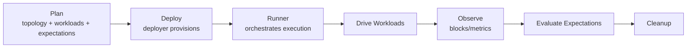

# Scenario Lifecycle

1. **Build the plan**: Declare a topology, attach workloads and expectations, and set the run window. The plan is the single source of truth for what will happen.
2. **Deploy**: Hand the plan to a deployer. It provisions the environment on the chosen backend, waits for nodes to signal readiness, and returns a runner.
3. **Drive workloads**: The runner starts traffic and behaviors (transactions, data-availability activity, restarts) for the planned duration.
4. **Observe blocks and signals**: Track block progression and other high-level metrics during or after the run window to ground assertions in protocol time.
5. **Evaluate expectations**: Once activity stops (and optional cooldown completes), the runner checks liveness and workload-specific outcomes to decide pass or fail.
6. **Cleanup**: Tear down resources so successive runs start fresh and do not inherit leaked state.

